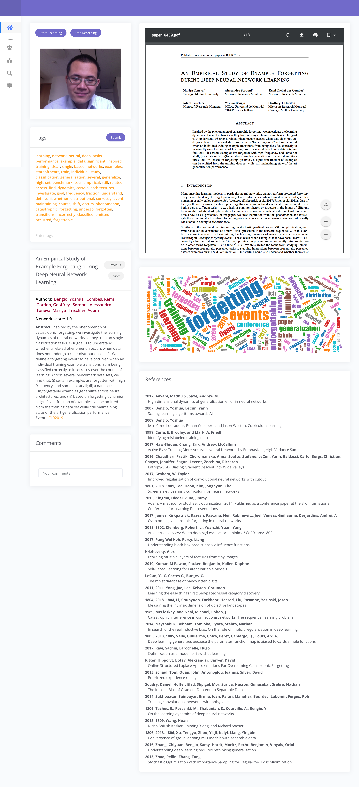
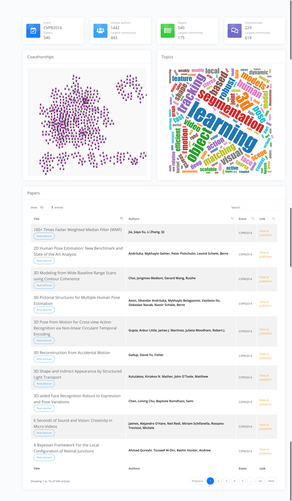
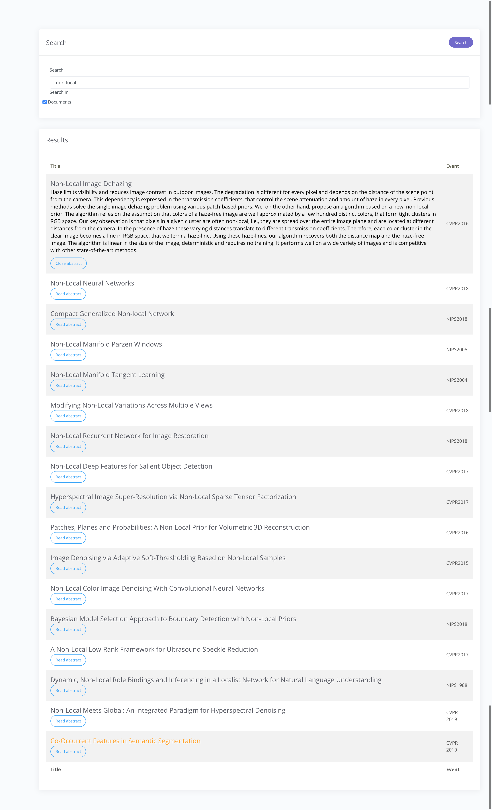

paddict
=====
A simple offline reader app for paper addicters. When plugged in to an Internet connection, paddict can crawl papers from public resources to their own storage. When turing off all Internet connections, paddict provide features for indexing and reading downloaded papers.

### Features

* **Statistical overview dashboard** including visualizations of authors graph (their collaborations wth interactive tools thanks to [CytoScape](http://js.cytoscape.org), word cloud of keywords extracted from paper titles, statistics of participants and papers, etc.

* **Interactive reader** which utilises a PDF reader to help faster reading and summarizing paper in only once view.

* **Graph and relational databases** to manage author-paper relationships and author-author relationships.
We use SQL and [Neo4J](https://neo4j.com/docs/cypher-manual/current/) for this purpose.

### TODO

* Extract references list of each papers.
* Move graph layout to server side.
    * Currently, it is processed in the client with fCoSE algorithm or CoSE algorithm, but even the faster version requires several minutes to finish interactive drawing of graph layouts.


### Changes

* Added a __network score__ to identify whether a paper is produced by the maximal connected component in the collaboration graph.
In another word, it is calculated as the ratio between the size of the largest connected component for which one of the authors of the paper belongs to, over the size of the largest connected component in the computed collaboration graph.
The computation of collaboration graph can be described as is: each node of the undirected graph represent one of 4,124 authors whose names presented in at least one of 1,294 papers in the sample collection.
All weights are zeros.
Given two authors (u,v), for each paper they collaborated (names are in the author list of the paper), the weight of the edge (u,v) is increased by one.
When the __network score__ is one, you can interpret that one of the author is in the largest connected component of the collaboration graph.
A visualization of the collaboration graph with the CVPR2019 dataset can be found in: [https://plot.ly/create/?fid=marxen68:4](https://plot.ly/create/?fid=marxen68:4).

* Added tagging features: A predefined list of keyword are tokenized from titles of papers in the dataset as the initial tag set. 
When a user input a **query tag**, it will be matched with the **supporting set** of tags in the relational database.
The relationship between query tag and the supporting tag set is exploited to enhance the tagging process.
These document-level labels are noisy, to be cautious!

* Now use OCR to extract the whole text content from PDF. The text is then tokenized and parsed into keywords and then is visualized in the reader page.

* Added note features.

* Currently, to monitor the reading processes, we employ several features: 

	* __Webcam__: to capture the reading profile. Unlike other activities such as driving, which need part information like hand signals (driving is done by hands and fingers), reading is completely done by eyes. Therefore, we focus on monitoring the face information only.
	* [__Blinking__](https://en.wikipedia.org/wiki/Blinking): readers who are likely to fall asleep during reading papers often have __abnormal__ blinking. We choose this as our analysis target.


* Added pattern matching by [Elasticsearch](https://www.elastic.co/products/elasticsearch).

### Acknowledgement

About CVF papers, a mention from  the [source](http://openaccess.thecvf.com/CVPR2019.py):
```
These CVPR 2019 papers are the Open Access versions, provided by the Computer Vision Foundation.
Except for the watermark, they are identical to the accepted versions; the final published version of the proceedings is available on IEEE Xplore.
This material is presented to ensure timely dissemination of scholarly and technical work. Copyright and all rights therein are retained by authors or by other copyright holders. All persons copying this information are expected to adhere to the terms and constraints invoked by each author's copyright.
```

### Demo
In a personal setting, the webapp should be launched from a local PC without any Internet connection (offline mode).

#### Reader




#### Dashboard




#### Search

