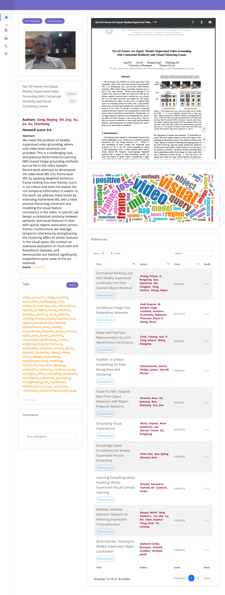
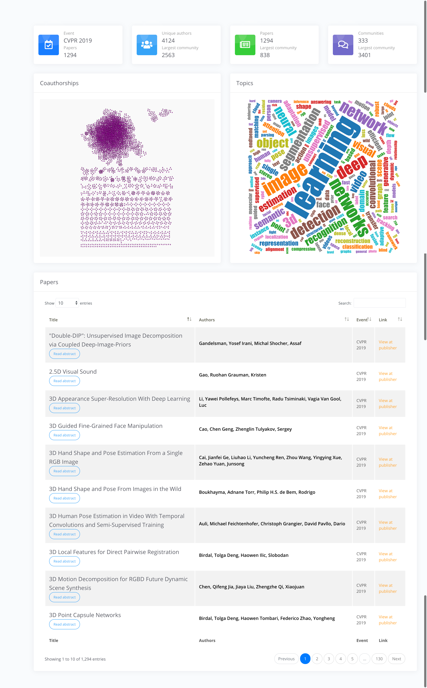

paddict
=====
A simple reader app for paper addicters. Crawling and reading papers from major venues on your own server.

### Acknowledgement

About CVF papers, a mention from  the [source](http://openaccess.thecvf.com/CVPR2019.py):
```
These CVPR 2019 papers are the Open Access versions, provided by the Computer Vision Foundation.
Except for the watermark, they are identical to the accepted versions; the final published version of the proceedings is available on IEEE Xplore.
This material is presented to ensure timely dissemination of scholarly and technical work. Copyright and all rights therein are retained by authors or by other copyright holders. All persons copying this information are expected to adhere to the terms and constraints invoked by each author's copyright.
```

### Pages

#### Reader




#### Dashboard



